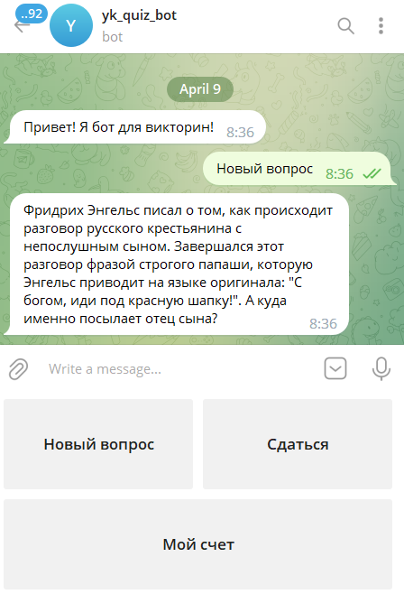
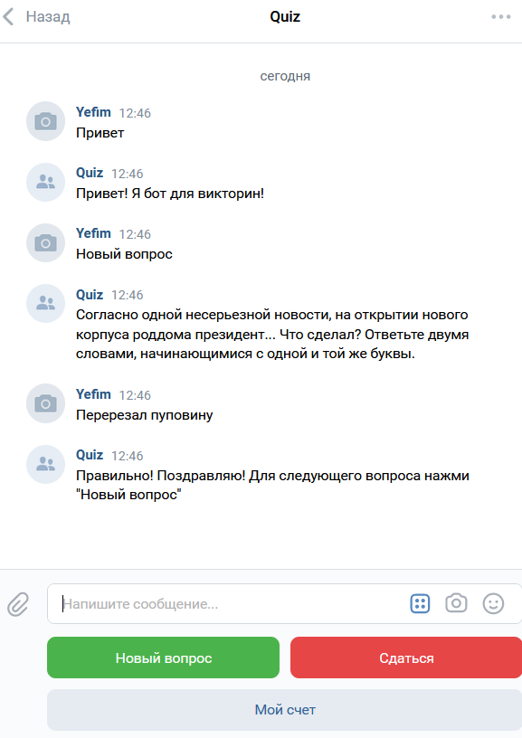

# Quiz bot

The project works with the following components:

- "Telegram quiz bot" conducts quizzes for [Telegram](https://telegram.org/) users;
- "VK quiz bot" conducts quizzes for [VK](https://vk.com/) users;
- "Redis database" is used as a current user question cash (go to [redislabs.com](https://redislabs.com/) to learn more about the Redis platform).

## Demo bots

- "Telegram quiz bot" demo is [here](https://t.me/yk_quiz_bot)



- "VK quiz bot" demo is [here](https://vk.com/im?media=&sel=-219842261)



## Prerequisites

Python 3.11 is required.

## Installation

- Download the project files.
- It is recommended to use [venv](https://docs.python.org/3/library/venv.html?highlight=venv#module-venv) for project isolation.
- Set up packages:

```bash
pip install -r requirements.txt
```

- Go to [@BotFather](https://t.me/BotFather) and register your "Telegram quiz bot";
- Create your VK group at [vk.com](https://vk.com/);
- **Note**: Bots can't initiate conversations with users. You must send a message to your bot first.
- Put questions files into a folder. The examples of the questions files are in the [questions_examples](./questions_examples/) folder.

- Set up environmental variables in your operating system or in .env file. The variables are:
  - `QUESTIONS_FOLDER` is a path to the folder with questions files (optional, `questions` by default);
  - `QUIZ_BOT_TOKEN` is your "Telegram quiz bot" token from [@BotFather](https://t.me/BotFather) (obligatory for "Telegram quiz bot");
  - `REDIS_HOST` is a public endpoint of your database at [redislabs.com](https://redislabs.com/) (obligatory);
  - `REDIS_PASSWORD`is a password of your database user at [redislabs.com](https://redislabs.com/) (obligatory);
  - `REDIS_PORT` is a port of your database at [redislabs.com](https://redislabs.com/) (obligatory);
  - `VK_GROUP_TOKEN` - is a token of your group at [vk.com](https://vk.com/) (obligatory for "VK quiz bot").

To set up variables in .env file, create it in the root directory of the project and fill it up like this:

```bash
QUESTIONS_FOLDER=/home/my_user/questions/
QUIZ_BOT_TOKEN=replace_me
REDIS_HOST=replace_me
REDIS_PASSWORD=replace_me
REDIS_PORT=13604
VK_GROUP_TOKEN=replace_me
```

## Usage

- Start your "Telegram quiz bot":

```bash
python tg_bot.py
```

- Start your "VK quiz bot":

```bash
python vk_bot.py
```

- Go to the bots and take part in a quiz.

## Project goals

The project was created for educational purposes.
It's a lesson for python and web developers at [Devman](https://dvmn.org/).
